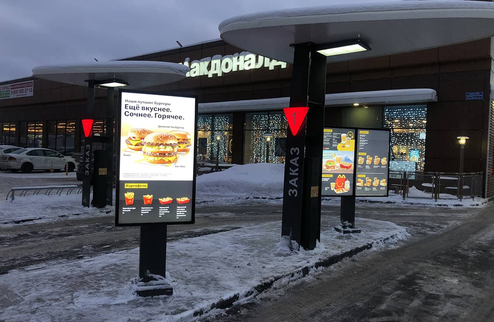

# Цель
 - Вывести фукнциональность КАПС на уровень топовых конкурентов
 - Покрыть дополнительные отрасли

# Список новой функциональности
Срок реализации: 4 - 6 месяцев.

В данном списке пункты пронумерованы для удобства перекрестных ссылок и не являются порядком реализации функциональности. Календарь релизов с порядком будет определен после утверждения этого списка.

## 1. Поддержка событий
Возможность прерывания трансляции плеера для вывода экстренного оповещения (пожар, воздушная тревога и тд) или другого контента определенного клиентом.

События можно разделить на внешние и внутренние.

**Внешние события** - можно получать как и с определенных серверов оповещения, так и из внешних датчиков, эти 2 кейса должны покрывать все потребности получать события извне.

**Внутренние события** - это поведение запрограммированное самим клиентом средствами личного кабинета КАПС. К примеру - прерывание трансляции плеера для вывода более важной информации по расписанию, по определенным датам и тп.

## 2. Плейлист с прямым управлением порядком контента
КАПС изначально заточен под рекламные сети и при формировании очереди воспроизведения сам определяет очередь показов, вставляя филеры в пустоты или разнося некоторые ролики в разные стороны. Основным для него является обязательное количество показов в рамках блока. Таким образом КАПС гарантирует количество показов, купленное рекламодателем.

Но клиентам, чей бизнес не связан с продажей рекламы, бывает нужен обычный плейлист, который они будут формировать вручную, а он будет проигрываться в строго заданном порядке циклически.

<!---
типа Триггер (Иногда требуется прервать трансляцию плеера и вывести экстренное оповещение (пожар, тревога и тд)
(Оба кейса по сути решаются событийным режимом, надо в PG organization->license добавить :calendar)
(после проигрывания external триггера, schedule продолжает играться с места прерывания)
(Оба кейса по сути решаются событийным режимом, надо в PG organization->license добавить :calendar)
(после проигрывания external триггера, schedule продолжает играться с места прерывания)
-->

## 3. Дистибутив плеера на Linux
Linux - операционная система с открытым исходным кодом, она бесплатная и ее не могут запретить. Нам она нужна для расширения линейки наших мини ПК в сторону удешевления оборудования. 
Также, в случае если у клиента уже есть ПК - это позволит не покупать ему лицензию на Windows.

## 4. Дистибутив плеера на Android и Tizen
Актуально для всех, кому дорого покупать светодиодку в принципе, либо у них уже куча телеков. Это позволит устанавливать КАПС практически на любой телевизор.

## 5. Прием данных от внешних датчиков
<!--
Прием данных от внешних сенсоров (через API плеера) и отправка на сервер
- Плейлист типа ГЕО
(https://gsm-repiteri.ru/prodazha/antenny-gps-glonass/priyomnik-gps-globalsat-bu-353s4-usb)
(http://wiki.amperka.ru/articles:gps:nmea)
-->
Открывает большие возможности взаимодействия с внешним миром. Приведу пару примеров:

- Необходимо установить экраны в транспорт (автобус, вагон метро), а клиент ставит задачу показывать различный контент в зависимости от района или остановки. В данном примере автобус необходимо доукомплектовать GPS треккером (или подключить свой), а для метро специализированное оборудование. КАПС будет принимать сигналы от этих устройств и вывгодить соответствующий контент.

- Клиент ставит задачу реализовать управления жестами для развлекательных или других целей (примеры: если помахать в экран, то появляется бренд-персонаж и машет в ответ; если смахнуть рукой, то проигрывается другой плейлист). В данном примере решение доукомплектовывается интеллектуальной камерой, сигналы от которой принимает КАПС и выводит соответствующий контент.

## 6. Развитие API
Программный интерфейс, который позволит другим программам управлять КАПСом. API должен быть у любой крупной облачной системы.

(Он у нас уже есть в начальном состоянии, но его надо развивать)

## 7. Модуль интеграции с локальной БД  (CAPSLOOK SDK).
Должен включать поддержку всех БД: MSSQL, MySQL, Firebird, Postgres, XML файлы.

Требуется для взаимодействия с кафе, ресторанами, ритейлом и тп. Решение должно быть максимально гибким, поэтому предлагаю реализовать на уровне БД (а не программного интерфейса) - такой способ нам позволит сильно выиграть в гибкости, но проиграть в простоте настройки. Настройка должна будет производиться специалистом КАПС (займет 30-60 минут).

Пример: клиент ставит задачу вывести на экраны цифровое меню. Для реализации этой задачи нам требуется всегда иметь свежие данные: ассортимент и цены, для этого требуется подключение к локальной БД заведения.

## 8. Поддержка внешнего источника данных.
Пример: у клиента есть сервер, где выводятся необходимые ему данные и он хочет вывести эти данные в каком-либо виджете или html-контенте на экран.

Это решается указанием адреса внешнего источника данных (сервера) в определенном формате внутри виджета или html-контента.

Данная фича не требует от нас особых внедрений и описана для понимания самого механизма, а также возможности ссылаться на него.

## 9. Поддержка IPTV
Фишка для трансляции корпоративного ТВ. Возможно мало кому нужна, но есть у всех конкурентов.

## 10. Виджет цифрового меню
Виджет будет иметь несколько вариантов оформления (шаблонов). Примеры:

Данные сможет получать как из локальной БД (описан в пункте 7) так и из удаленного источника (описан в пункте 8).

## 11. Детализация воспроизведения
Для особо капризных клиентов - разработать механизм фиксирования факта каждого воспроизведения.

По сути плеер будет отчитываться перед сервером каждый раз, как закончит воспроизведение ролика. Это будет являться фактом, что плеер работал и воспроизвел ролик, однако не будет являться фактом, что экран был исправен. (За исправностью экрана требуется следить отдельно, об этом в пункте 14).
<!--
(http://wiki.visiobox.ru/ru/%D0%98%D0%BD%D1%82%D0%B5%D0%B3%D1%80%D0%B0%D1%86%D0%B8%D0%B8/%D0%9B%D0%BE%D0%B3%D0%B8%20%D0%B2%D0%BE%D1%81%D0%BF%D1%80%D0%BE%D0%B8%D0%B7%D0%B2%D0%B5%D0%B4%D0%B5%D0%BD%D0%B8%D1%8F%20%D0%BF%D0%BB%D0%B5%D0%B5%D1%80%D0%BE%D0%B2.html)
-->

## 12. Создатель виджетов
Самое сложное внедрение, но закроет практически все нестандартные запросы клиентов.

Позволит клиенту создавать сложный контент с индивидуальным оформлением, анимациями и работой с динамичными данными.

Это может быть как статичный виджет - красивая анимированная череда событий, так и динамичный - с выводом информации из локальной БД (описан в пункте 7) или удаленного источника (описан в пункте 8).

Короткий пример того, как может происходить процесс создания виджета:

https://github.com/caps-look/todo/assets/105486590/6901b323-0ba5-4535-b676-93027f00fbf5

.

> [!NOTE]
> Экспериментальные фичи

Функциональность из этого списка может быть не внедрена, т.к. носит экспериментальный характер, однако эксперименты и выводы должны быть сделаны.

## 13. Форматы более 12K
Идея в том, чтобы такие кейсы решать не суперкомпьютером, а предвирительной подготовкой видео: делением видео на сегменты и воспроизведении в режиме многооконности.

В свою очередь это потребует синхронной работы всех окон плеера, с очень высокой точностью. Эксперимент будет заключаться в возможности добиться требуемой точности.

## 14. Контроль исправности кабинетов
Новая версия КАПС будет поддерживать общение с внешними источниками. Нам требуется либо на уровне драйвера кабинета, либо на уровне установки датчика обрыва (не знаю устройства электроники кабинета, но думаю это возможно) получать сигнал или команду, которая будет идти на КАПС, а он оперативно информировать о наличии поломки по смс/почте/мессенджер. Эксперимент будет заключаться в отработки вариантов получения сигнала обрыва.
